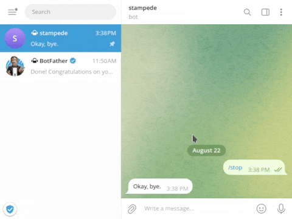

# Stampede

Stampede is a Telegram bot for dealing with user management on [Xray](https://github.com/XTLS/Xray-core/).



## Features

- Users with custom usernames (emails) can be added
- Users can be either persistent (surviving Xray restarts) or non-persistent
- A URI and QR code are provided for user connection upon creation
- A list of users is available
- Traffic usage for each user since the last Xray restart can be monitored
- Users can be removed as needed

## Known Limits

- Only VLESS inbounds are supported

## Installation

Stampede relies on the InfluxDB 2.x open-source time series database to track users' traffic usage. First, [download and install InfluxDB v2](https://docs.influxdata.com/influxdb/v2/install/#download-and-install-influxdb-v2).

Next, clone the repository and install the required dependencies:

```bash
git clone https://github.com/parsafat/stampede.git
cd stampede
pip install -r requirements.txt
```

## Configuration Guide

This section provides details on how to configure the `config.ini` file. The configuration file is organized into four sections: `[telegram]`, `[influxdb]`, `[xray]`, and `[uri]`. Below are the explanations for each section.

### [telegram] Section

This section configures your Telegram bot. The `bot_token` is required for the bot to function and can be obtained from [BotFather](https://t.me/BotFather). The `super_user_id` should be set to the Telegram user ID of the individual who will have administrative control over the bot.

### [influxdb] Section

This section is used to connect to your InfluxDB instance. The `token` is the API token generated during the setup of InfluxDB. The `org` should be the name of your InfluxDB organization. The `url` is the address of your InfluxDB instance. The `bucket` is the name of the bucket where data will be stored.

For more details on setting up InfluxDB, refer to the [InfluxDB setup guide](https://docs.influxdata.com/influxdb/v2/get-started/setup/).

### [xray] Section


This section configures Xray, including its API and statistics features. The `config` entry specifies the path to your Xray configuration file. The `api_address` is the address on which the Xray API listens, and the `api_port` is the port number for the API. These values should match those specified in your Xray configuration file.

#### Xray Configuration Notes

Ensure that the Xray API is configured to enable `HandlerService` and `StatsService` in the [API settings](https://xtls.github.io/config/api.html#apiobject) of your Xray configuration. Also, include the [`stats` object](https://xtls.github.io/config/stats.html#statsobject) and configure the [policy settings](https://xtls.github.io/config/policy.html#policyobject) to track relevant data.

For detailed configuration instructions on statistics, refer to the [V2Fly Traffic Statistics Tutorial](https://guide.v2fly.org/advanced/traffic.html). As mentioned earlier, also ensure that `HandlerService` is enabled for adding and removing users. If using Xray version 1.8.13 or later, you can simplify the configuration by utilizing the `listen` item in the `api` object instead of adding a `dokodemo-door` inbound.

Also, to ensure proper functionality of this bot, the main inbound object that contains the users must have the tag 'vless'.

### [uri] Section

This section defines the connection details for your users. The `address` is the address of the proxy server, `port` is the port on which the proxy server operates, and `path` is the path used to connect to the server.

## Usage

```bash
./stampede.py
```
